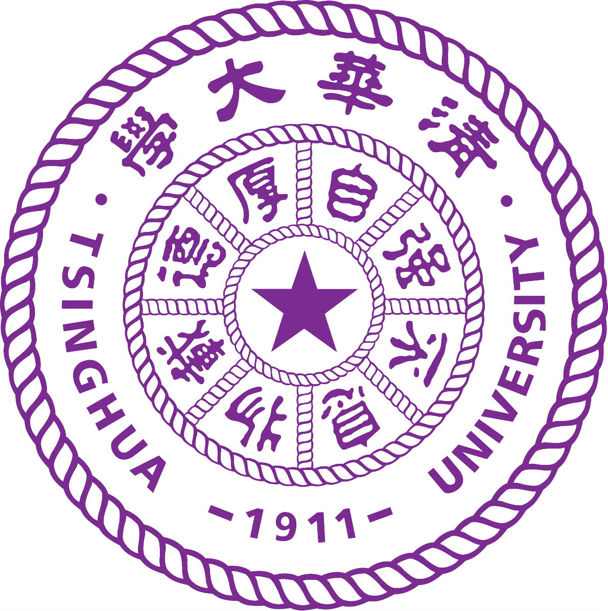
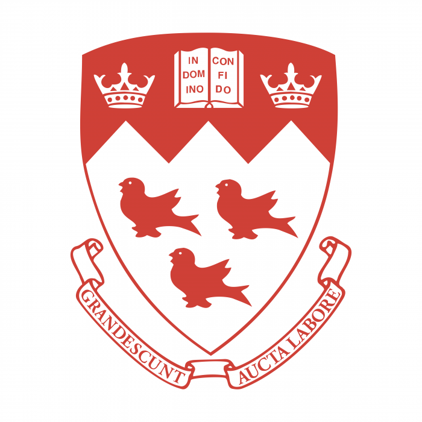

## About Me
 

Here is **Jichuan Yu (于济川)**, you can also call me **Jerry**.

I am a Ph.D. candidate in the [Department of Mechanical Engineering](https://me.tsinghua.edu.cn/en/) at Tsinghua University, under the supervision of Prof. [Chuxiong Hu](https://me.tsinghua.edu.cn/en/info/1275/2062.htm). I got my bachelor degree in Mechanical Engineering at Tsinghua University in 2021.

I have a broad interest in motion planning and control for advanced mechatronic systems, such as manipulators and CNC machines. I am dedicated to empowering mechatronic systems with greater intelligence through innovative algorithms, enabling them to serve humankind more effectively.

My current research focuses on optimization-based coordinated motion planning for dual-arm robotic systems. Dual-arm robotic systems can mimic human arms to perform more complex tasks collaboratively. However, their higher dimensionality and more complicated constraints, such as inter-arm collisions and the kinematic coordination of end effectors, pose greater challenges to motion planning, which is formulated as a non-convex optimization problem. My research aims to develop an efficient method to solve such a problem. I'm also working on designing a real-time motion planning framework that enables dual-arm robotic systems to operate efficiently and safely in dynamic environments. 

Prior to this, I have also worked on some interesting projects, such as laser-assisted 3D printing. More details can be found in the [research](/research/index.html) section.

 **Contact:**
 yujc21@mails.tsinghua.edu.cn
 yujcjerry@gmail.com

---

## Education

**Ph.D. in Mechanical Engineering - Tsinghua University**
 Sep. 2021 - Jun. 2026 (expected)
 Beijing, China

 
**Bachelor in Mechanical Engineering - Tsinghua University**
 Sep. 2017 - Jun. 2021
 Beijing, China

 
**Exchange Student in Mechanical Engineering - McGill University**
 Aug. 2019 - Dec. 2019
 Montreal, Canada

---

## Selected Publications

- **J. Yu**, Z. Jin, C. Hu, et al., **"Hierarchical real-time motion planning for safe multi-robot manipulation in dynamic environments,"** in *IEEE International Conference on Advanced Robotics and Mechatronics (ICARM)*, Tokyo, Japan, 2024. **(Best Paper Award in Advanced Robotics)** (In Press)

- **J. Yu†**, C. Hu†, Z. Wang, et al., [**"Printing three-dimensional refractory metal patterns in ambient air: Toward high temperature sensors,"**](https://onlinelibrary.wiley.com/doi/10.1002/advs.202302479) *Advanced Science*, vol. 10, no. 31, p. 2302479, 2023. **(Inside Back Cover)**

-  C. Hu, **J. Yu**, Z. Wang and Y. Zhu, [**"An iterative contouring error compensation scheme for five-axis precision motion systems,"**](https://www.sciencedirect.com/science/article/abs/pii/S0888327022003776) *Mechanical Systems and Signal Processing*, vol. 178, p. 109226, 2022.

